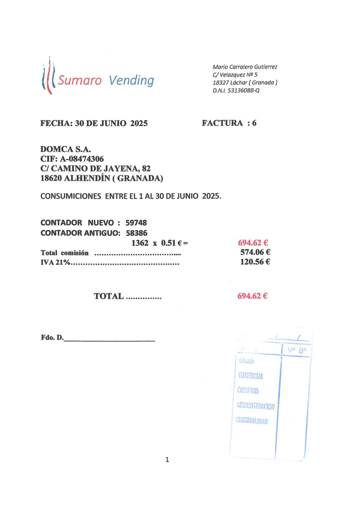

[](https://github.com/ekalinin/github-markdown-toc/actions/workflows/ci.yml)

<div id="top"/>
<details open>
Table of contents
=================
<!--ts-->
  - [Resumen Ejecutivo](#resumen-ejecutivo)
  - [Desafío Empresarial](#desafio-empresarial)
    - [Escenario Empresarial](#escenario-empresarial)
    - [Desafíos encontrados](#desafios-encontrados)
    - [Importancia para la Empresa](#importancia-para-la-empresa)
<!--te-->

  
<summary><b>Tabla de Contenidos</b> (click para abrir/cerrar)</summary>
<!-- TOC updateonsave:false -->
  - [Resumen Ejecutivo](#resumen-ejecutivo)
  - [Desafío Empresarial](#desafio-empresarial)
    - [Escenario Empresarial](#escenario-empresarial)
    - [Desafíos encontrados](#desafios-encontrados)
    - [Importancia para la Empresa](#importancia-para-la-empresa)
  - [Estrategia de IA](#estrategia-de-ia)
    - [Objetivos](#objetivos)
    - [Enfoque de Automatización](#enfoque-de-automatizacion)
    - [Herramientas de LLM y Make.com u otras a utilizar:](#herramientas)
  - [Análisis de Datos e Insights si aplica](#analisis-de-datos)
  - [Prototipo de Automatización Make.com](#prototipo-de-automatizacion)
    - [Requisitos](#requisitos)
    - [Herramientas](#herramientas)
    - [Flujo](#flujo)
    - [Descripción paso a paso del flujo de trabajo en Make.com:](#descripcion-flujo)
    - [Captura de pantalla o diagrama de tu flujo de trabajo:](#diagrama-flujo)
  - [Consideraciones Éticas y Riesgo](#consideraciones-eticas)
    - [Riesgos éticos identificados:](#riesgos)
    - [Medidas tomadas para mitigar estos riesgos:](#medidas-tomadas)
  - [Métricas de Éxit](#metricas)
    - [¿Cómo vamos a medir el éxito de tu proyecto? KPIs](#kpis)
    - [¿Qué resultados esperas obtener?](#resultados)
    - [Gráficos de KPIs Ejemplos:](#graficos)
  - [Reflexiones Finale](#reflexiones)
    - [¿Qué fue lo más valioso que aprendiste durante este proyecto?](#aprendizaje)
    - [¿Qué harías diferente si implementaras este proyecto en la vida real?](#implementacion)
  - [Propuestas de Mejoras](#propuestas-de-mejoras)
<!-- /TOC -->
</summary>
</details>
-----

<!-- TOC ignore:true -->
## Estudio del ciclo de gestión y archivo de facturas recibidas en una pyme industrial

<div id="resumen-ejecutivo"/>

### 1\. Resumen Ejecutivo [:top:](#top)
La **gestión manual de facturas de proveedores** es un proceso crítico pero ineficiente en la mayoría de las pymes, incluyendo nuestro caso de estudio, **Domca**. El proceso actual, basado en la recepción multicanal (papel, email), la entrada de datos manual y el archivo físico, genera importantes cuellos de botella.

Este proyecto propone y desarrolla un prototipo de solución basado en técnicas de digitalización y herramientas de automatización para transformar este flujo de trabajo. La solución permite:

- Centralizar y digitalizar la recepción de todas las facturas recibidas.

- Extraer automáticamente los datos clave de las facturas.

- Crear un borrador de asiento contable en el Sistema de Gestión Contable para su validación final por parte de la persona responsable.

Los beneficios clave que se pretenden alcanzar con esta propuesta, son una drástica reducción de costes operativos, la minimización de errores humanos, el cumplimiento garantizado de los plazos de pago, y la creación de un archivo digital trazable y accesible, liberando al personal para tareas de mayor valor añadido.

-----
<div id="desafio-empresarial"/>

### 2\. Desafío Empresarial [:top:](#top)
<div id="escenario-empresarial"/>

#### Escenario Empresarial [:top:](#top)
El proyecto se centra en la empresa **Domca**. Se trata de una pyme del sector industrial que realiza su actividad principal en territorio Español y que recibe mensualmente entre 200-300 facturas de proveedores por múltiples canales (email, correo postal, ...). Su flujo de trabajo actual es un ejemplo perfecto del proceso manual tradicional, con todas las ineficiencias asociadas. La optimización de este proceso no es solo una mejora, sino una necesidad estratégica para mantener la competitividad y facilitar su crecimiento.

Para entender la magnitud del desafío, es crucial detallar el ciclo de vida actual de una factura en **Domca**:

- **Recepción**: La empresa recibe facturas de sus múltiples partners (proveedores, acreedores) relacionadas con su actividad comercial. Estas llegan por diversas vías, principalmente por correo postal en formato papel o como adjuntos digitales en correos electrónicos.

- **Procesamiento y Contabilización Manual**: Una vez recibida una factura, un responsable comprueba su corrección. A continuación, se realiza un doble trabajo: se introduce manualmente la información en el Sistema de Gestión Contable. Las facturas digitales se imprimen para generar una copia física que se pueda archivar.

- **Archivo Físico**: Como punto final, la copia en papel de la factura se archiva. Por requisito legal en España, este archivo físico debe conservarse durante un periodo mínimo de cinco años.

- **Continuación del Flujo**: Solo después de que la factura ha sido registrada y archivada, se pueden iniciar los siguientes procesos administrativos, como la programación del pago al proveedor o la confirmación de la recepción de los productos.

Este proceso, enteramente manual, es la fuente directa de los desafíos operativos que enfrenta **Domca**.

El proyecto, aborda la problemática descrita y propone algunas soluciones para la optimización del proceso de gestión y archivo de facturas recibidas, eliminando parcialmente la necesidad de intervención humana.

El siguiente esquema, refleja el proceso tal y como se realiza actualmente.


-------
<div id="desafios-encontrados"/>

#### Desafíos encontrados [:top:](#top)
Dados los problemas asociados a un proceso manual como el descrito y con el objetivo de poder proponer soluciones que los eliminen al menos en parte, debemos hacer frente a los siguientes desafíos identificados:

- **Múltiples puntos de entrada**. Las facturas llegan por diferentes vías, generando dispersión y riesgo de pérdida. Cada vía de entrada presenta su propia problemática
    - **Facturas en papel entregadas por correo postal**, a domicilio. En este caso, es habitual su deterioro por la manipulación, transporte, puede ser difícil su interpretación por la baja calidad de la impresión, ... 
    - **Facturas recibidas en formato digital por correo electrónico**. Habitualmente, estas facturas las reciben empleados de la empresa sin relación con el departamento de contabilidad, también es habitual que estos correos electrónicos sean marcados como spam, o que se **despisten** entre todos los correos recibidos y acaben en la papelera.    

    **Propuesta de solución.** La solución propuesta es el establecimiento de una vía de entrada **centralizada** para las facturas de proveedor y la digitalización de las mismas, puede ayudar en este sentido.

    Hay que tener en cuenta que el proceso de digitalización previo, presenta sus propios desafíos que habrá que tener en cuenta: facturas recibidas en formato papel deterioradas o de baja calidad, facturas con formatos diversos y con información poco reconocible o localizable en el documento, ...

- **Proceso de gestión y archivo manual**. El que se trate de un proceso que se gestiona manualmente de principio a fin plantea una serie de problemas:
    - **Retrasos significativos**. El tiempo destinado por el personal de la empresa para la gestión y archivo de las facturas de proveedor, puede provocar un cuello de botella, llegando a generar retrasos en los pagos e incumplimientos de la normativa legal aplicable.
    Podríamos estimar que el tiempo **promedio** destinado a la gestión y archivo de una factura, se sitúa en el rango **entre 15 y 20 minutos**.

    - **Errores frecuentes**. La gestión y archivo **manual** de las facturas de proveedor, puede provocar la aparición de errores humanos: errores en la identificación de información, errores en la contabilización, registros duplicados, pérdida de correos electrónicos por recibirse en cuentas de correo **no habituales** o correos electrónicos marcados como spam, ...
    El proceso actual requiere clasificación manual, extracción de datos, validación y registro en el **Sistema de Gestión Contable**.
    Podríamos establecer **una media de un 15%** en el número de facturas recibidas que tienen algún tipo de incidencia durante su gestión.

    - **Gran consumo de recursos**. En una pyme, podemos identificar el proceso de registro y archivo de facturas de proveedor como uno de los más costosos en cuanto a tiempo empleado.

    - **Falta de escalabilidad**. Relacionado con el anterior, al tratar con un proceso manual, nos encontramos con que es poco escalable. El aumento en la cantidad de facturas procesadas (por una crecimiento en el volumen de transacciones) implicará inevitablemente el aumento en los recursos humanos destinados al proceso y esto habitualmente no es justificable.
    La empresa puede ver comprometido su crecimiento por ser incapaz de procesar mayor cantidad de información sin sobredimensionar departamentos como el contable. Es común que este proceso de gestión se convierta en un cuello de botella en la gestión comercial de la empresa.

    **Propuesta de solución.** Analizando estos desafíos, vemos que el uso de herramientas de automatización, puede beneficiar bastante al proceso de gestión y archivo de facturas recibidas, reduciendo en un alto porcentaje la interacción humana en el mismo.

    De nuevo, el uso de este tipo de herramientas, plantea sus propios desafíos a tener en cuenta: ¿como aseguramos la calidad del proceso?, ¿qué hacemos en el caso de que se produzca algún error en el mismo?, ...

- **Sistema de archivo poco eficiente**. El requisito legal de guardar copia de las facturas recibidas durante un periodo de tiempo, junto con el hecho de que dicha copia se guarda habitualmente en formato papel, presenta su propia problemática.
    - **Altos requerimientos de espacio**. La empresa debe destinar un espacio acondicionado (sistema de extinción contra incendios, de seguridad, de vigilancia, ...) para el archivo en papel de las facturas recibidas.
    Este archivo debe ser mantenido por la empresa por un periodo de tiempo establecido por la normativa fiscal. 
    Este archivo es poco eficiente al tener un sistema de ordenación básico (las facturas se ordenan por ejercicio fiscal y por orden alfabético) que hace que las consultas sean muy costosas en tiempo.

    - **Falta de trazabilidad**. A lo comentado anteriormente, se suma el hecho de que el sistema de gestión y archivo utilizado hace que se pierda el rastro del propio proceso (vía de llegada, persona responsable de su gestión, ...) e incluso del contenido de las facturas (en el Sistema de Gestión de Contabilidad, solo se reflejan los totales de las mismas, quedando el detalle solo en el documento físico)

    **Propuesta de mejora.** La mejora clave es plantear un sistema de almacenamiento digital para las facturas recibidas, va a mejorar el archivo, consulta y trazabilidad de las mismas.

    De nuevo, este tipo de soluciones, plantea sus propios interrogantes como: ¿si el sistema de digitalización empleado cumple la normativa legal necesaria para poder eliminar los documentos en papel?, ¿qué infraestructura se necesita para el archivo digital de las facturas?, ¿infraestructura on-premise o en la nube?, ...

<div id="importancia-para-la-empresa"/>

#### Importancia para la Empresa [:top:](#top)
Como se comentó, la gestión y archivo de facturas recibidas, es un requerimiento legal para cualquier empresa, independientemente de su tamaño y sector de actividad.

En este aspecto, **Domca** no es ninguna excepción, además al tratarse de una pyme industrial con un coste de estructura alto y poco margen, la optimización de los flujos de trabajo se convierte en una necesidad para su propio crecimiento. Es por esto que es de gran importancia la aplicación de herramientas digitales y de automatización en un proceso que a día de hoy se realiza de forma manual.

Con la aplicación de este tipo de herramientas, podremos ver mejoras en los siguientes aspectos:

- **Eficiencia operativa:** Permite procesar mayor volumen de facturas con menos recursos. En el caso de estudio, al ser una pyme, los recursos tanto de espacio como de personal, son limitados y por lo tanto es un requisito **esencial** la optimización de dichos recursos.

- **Cumplimiento Normativo (Compliance):** Mejora el cumplimiento de obligaciones fiscales y plazos de pago. Como se indicaba anteriormente, existen normativas que regulan los plazos de pago de facturas recibidas, mejorando el proceso de gestión de estas facturas, estaremos evitando incurrir en faltas a este respecto.

- **Mejora de Relaciones Comerciales:** Reduce retrasos que afectan la relación con proveedores. La reducción del tiempo de procesamiento, supondrá una mejora de las relaciones de la empresa con sus socios comerciales y proveedores y por lo tanto mejorará su credibilidad frente a ellos.

- **Escalabilidad del Negocio:** Permite el crecimiento del negocio sin incremento proporcional de personal. Se podrá hacer una mejor asignación de recursos a los distintos procesos de gestión de la empresa. Como efecto colateral, podemos destacar que la regulación de las cargas de trabajo mejorará en general la satisfacción del personal.

- **Impulso a la Digitalización:** Reduce los requerimientos de espacio y tiempo para el archivo de los documentos, a la vez que mejora las consultas de los documentos archivados.

- **Reducción de Errores:** Minimiza los fallos humanos inherentes al proceso manual.

-----

<div id="estrategia-de-ia"/>

### 3\. Estrategia de IA [:top:](#top)
Como se ha descrito, el procesamiento manual de facturas de proveedores genera retrasos significativos, errores humanos y consume recursos valiosos del equipo de contabilidad. El proceso actual requiere clasificación manual, extracción de datos, validación y registro en el sistema ERP. Para solucionar esto, no basta con digitalizar documentos, sino que se requiere una estrategia integral que combine automatización e inteligencia artificial.

Las soluciones propuestas y los interrogantes que debemos resolver, son:
- Establecer una **vía de entrada centralizada** y **digitalizar las facturas**.
    - ¿Qué hacer con facturas en papel deterioradas o de baja calidad?
    - ¿Y con formatos diversos e información poco reconocible?
    - ¿Cómo extraemos la información relevante?

- Usar herramientas de automatización para **minimizar la interacción humana**.
    - ¿Cómo aseguramos la calidad del proceso?
    - ¿Qué hacemos si se produce un error?
    - Una vez extraída la información, ¿qué hacemos con ella?

- Usar un **sistema de almacenamiento digital**.
    - ¿Cumple la normativa para eliminar el papel?
    - ¿Qué infraestructura se necesita? ¿On-premise o en la nube?

A continuación, se detalla la estrategia diseñada para dar respuesta a estas cuestiones.

<div id="objetivos"/>

#### Objetivos [:top:](#top)
Para dar respuesta a estos interrogantes, los objetivos concretos del proyecto son:

- **Automatizar la clasificación y preparación de facturas:** Reducir la intervención manual en la recepción y el pre-procesamiento de documentos (se estima que en un 85% de los casos).

- **Validar inteligente de la información extraída:** Asegurar de forma automática la coherencia y exactitud de los datos antes de su integración en el sistema ERP.
Se establecerán puntos de control automáticos y manuales (validación final) para asegurar la calidad de los datos que llegan al ERP.

- **Generar borradores de asientos contables de forma automática:** Usar la información extraída para generar automáticamente un borrador de asiento contable en Odoo. Esto responde a la pregunta de qué hacer con los datos.

- **Mantener un registro centralizado y actualizado del estado de cada factura:** Mejorar la trazabilidad y la visibilidad del proceso. Se persigue una **Trazabilidad total**.

<div id="enfoque-de-automatizacion"/>

#### Enfoque de Automatización [:top:](#top)
El problema se abordará mediante una combinación de **automatización de flujo de trabajo** y **extracción inteligente de información**.

Se plantea la implantación de un MVP que se apoye para su ejecución en herramientas en la nube como Google Sheet para mantener un registro de todo el proceso y Google drive como almacenamiento de las facturas en proceso.

La estrategia se basa en un flujo de trabajo 100% en la nube, orquestado por Make.com, que responde a los desafíos planteados:

Pretendemos utilizar la IA para leer y extraer con alta precisión la información de las facturas, respondiendo al desafío de los formatos diversos y la localización de datos. De esta forma, tendremos un punto de partida común y un formato homogéneo para las facturas a tratar.

- **Para la "Entrada Centralizada" y la "Calidad de los Documentos"**
    * Se establece una cuenta de correo (invoices@domca.com) como único canal. 

    * Las **facturas en papel** se escanean y se envían a esta cuenta. 

    * Las facturas en **formato digital**, se preprocesan para convertirlas a un formato estándar y se redirigen también a esta cuenta.

    * Utilizaremos un servicio IA para realizar un reconocimiento OCR del contenido de los documentos.

    * En el caso de **facturas de baja calidad** o con **información poco reconocible**: Nos apoyaremos en el hecho de que el servicio de reconocimiento óptico de caracteres nos proporcionará una "puntuación de confianza" del OCR. Si la calidad es demasiado baja para una lectura fiable, el flujo de trabajo lo derivará automáticamente a una carpeta de "Error / Revisión Manual" y notificará a un responsable.

    * **Make.com** gestionará la ingesta de correos electrónicos, la identificación de adjuntos y la conversión a formato PDF/A si es necesario, moviendo los documentos a sus respectivas carpetas y actualizando el estado en la hoja de cálculo de seguimiento. Así mismo, se encargará de interactuar con el servicio IA para la realización del OCR

- **Extracción de información (LLM)**
    Se usará un Modelo de Lenguaje para la extracción de la información de las facturas, ya que no dependen de plantillas fijas. El LLM entiende el contexto semántico del documento ("esto parece un CIF", "esto es un total") y puede extraer los datos sin importar dónde estén ubicados.

    * Solicitaremos al LLM la extracción de esta información y la entrega de los datos en un formato procesable (como JSON)

    * De nuevo, **Make.com** se encargará de interactuar con el servicio LLM para extraer la información relevante y prepararla en un formato que pueda ser utilizado posteriormente.

- **Validación y enriquecimiento de datos**
    Se realizarán validaciones sobre los datos extraídos (formato de fecha, sumas de líneas vs totales, validación de CIF/NIF contra el ERP, etc.) para asegurar la integridad.

    El flujo en **Make.com** incluirá:

    * **Validaciones Automáticas:** Comprobaciones matemáticas (suma de líneas vs. total) y de formato (CIF/NIF, fechas).

    * **Rutas de Error:** Si una validación falla o la IA no puede extraer los datos mínimos, el proceso se detiene para esa factura, se mueve a la carpeta "Error" y se registra el motivo en Google Sheets.

    * **Validación Humana Final:** El proceso no contabiliza la factura directamente, sino que crea un borrador en Odoo. La aprobación final siempre recae en un humano, lo que constituye el control de calidad definitivo.

- **Integración con el ERP**
    Una vez validados, los datos se utilizarán para crear un borrador de asiento contable en Odoo. En este asiento contable, se le adjuntará el documento digitalizado de la factura, además, se generará una actividad para la revisión por parte del responsable de contabilidad.

- **Almacenamiento Digital**
    Se opta por una solución 100% Cloud. Esto elimina la necesidad de invertir en servidores locales (on-premise), ofrece mayor escalabilidad, seguridad y accesibilidad, respondiendo directamente a la pregunta sobre la infraestructura.

- **Validez legal**
    La normativa española (Reglamento de Facturación y normativas de la AEAT) permite la sustitución del archivo físico por uno digital si se utiliza un proceso de Digitalización Certificada que garantice la integridad y autenticidad del documento. Para este prototipo, se utilizará un sistema de archivo digital estándar (Google Drive). En una implementación real, se debería usar un software homologado por la Agencia Tributaria para poder destruir legalmente el papel.

<div id="herramientas"/>

#### Herramientas de LLM y Make.com (u otras) a utilizar:  [:top:](#top)
- **Make.com:** Plataforma central para la orquestación de todo el flujo de trabajo, conectando los diferentes servicios y automatizando las tareas.
- **Google Workspace (Gmail, Google Drive, Google Sheets):** Para la recepción de correos electrónicos, almacenamiento de documentos y la base de datos de seguimiento del estado de las facturas.
- **Herramienta de conversión de archivos:** Una integración de Make.com para convertir imágenes a PDF (si el servicio OCR no lo soporta directamente).
- **Servicio OCR:** Para la extracción de texto de los documentos. Hay múltiples alternativas para el servicio de OCR, pero para este proyecto, asumiremos el uso de **EdenAI** por su integración en Make.com y soporte de múltiples tecnologías (entre ellas OCR y LLM).
- **LLM (Modelo de Lenguaje Grande):** Para la extracción estructurada de datos a partir del texto OCR. Se utilizará un LLM accesible a través de EdenAI o directamente una API de un proveedor (ej. OpenAI, Google Gemini). Para el ejemplo, asumimos **Google Gemini (vía EdenAI o Make.com)** dada su capacidad de entender texto complejo y generar JSON.
- **Odoo:** Como sistema de gestión ERP para la creación de asientos contables y la gestión de partners.

-----
<div id="analisis-de-datos"/>

### 4\. Análisis de Datos e Insights (si aplica) [:top:](#top)
En este caso, al tratarse de un proceso **operativo**, no utilizamos datasets ni otros orígenes de datos. 
La única información que manejaremos, será la extraída de las propias facturas que nos envíen nuestros proveedores.

Aún así, vamos a aprovechar este punto para especificar los **datos que se generen y procesen en tiempo real** a través de las facturas recibidas.

**Datos utilizados:**

- **Metadata del email:** Remitente, fecha/hora de recepción, asunto, contenido del email.
- **Documentos adjuntos:** PDF o imágenes de facturas.
- **Datos extraídos por OCR:** El texto completo reconocido de la factura.
- **Datos estructurados extraídos por el LLM:** Nombre del proveedor, número de factura, fecha, CIF, detalles de impuestos (tipo, base imponible, cuota), moneda, base imponible total, IVA total, total factura, y líneas de factura (descripción, cantidad, precio, total línea).
- **Estados de procesamiento de la factura:** Nueva, OCR, En Gestión, Error, Procesada.
- **Mensajes de error:** Descripción de cualquier problema durante el procesamiento.

**Información clave obtenida del análisis de los datos (potenciales insights):**
Una vez en producción, la recopilación de datos permitirá identificar:

- **Volumen de facturas por proveedor:** Qué proveedores envían más facturas.
- **Tiempos de procesamiento por etapa:** Cuánto tiempo se tarda en promedio en OCR, extracción LLM y contabilización.
- **Tasa de éxito de extracción LLM:** Qué porcentaje de facturas son procesadas correctamente por el LLM y cuáles requieren intervención manual.
- **Tipos de errores más comunes:** Si hay errores recurrentes en OCR (mala calidad de escaneo) o en la extracción LLM (formatos de factura complejos), permitiendo mejoras en los prompts o en la calidad de las facturas.
- **Origen de las facturas problemáticas:** Qué canales (email principal, reenvío, escaneo manual) generan más errores o requieren más tiempo.

**Cómo influyen estos insights en la estrategia:**
Estos insights permitirán **optimizar el flujo de trabajo y la configuración de las herramientas**:

- Si un proveedor genera constantemente errores de extracción, se podría crear un prompt específico o una regla de validación para ese proveedor.
- Si la tasa de éxito de OCR es baja para facturas escaneadas, se podría mejorar el proceso de escaneo o buscar un servicio OCR más robusto.
- La identificación de cuellos de botella en cualquier etapa del flujo de Make.com permitiría refinar los módulos o procesos para mejorar el rendimiento.
- El monitoreo continuo de los datos alimentará un ciclo de mejora continua de la automatización.

-----

<div id="prototipo-de-automatizacion"/>

### 5\. Prototipo de Automatización (Make.com) [:top:](#top)
Planteamos la siguiente descripción funcional del proyecto:

<div id="requisitos"/>

#### Requisitos [:top:](#top)
- Las facturas de los proveedores/acreedores, llegarán a nosotros por **varias fuentes**:
    * Idealmente, se recibirán en una cuenta de email destinada especialmente para ello (invoices@domca.com) a la que los proveedores/acreedores podrán enviar sus facturas como documentos adjuntos.
    * También se pueden recibir en una cuenta de email distinta (p.ej contabilidad@domca.com). El responsable de dicha cuenta, será el encargado de reenviar el correo a la cuenta para la gestión de las facturas.
    * Se pueden recibir en papel por correo ordinario. En este caso, el responsable de su gestión, se encargará de escanear el documento, prepararlo para su procesamiento y enviarlo por email a la cuenta destinada para la gestión de las facturas.
   
- Las facturas recibidas, pasarán por un primero proceso de **preparación** (partimos de que todas las facturas recibidas se almacenarán en un formato PDF/A). 
    * Las facturas que se reciban en un formato distinto de PDF, **se convertirán** al formato correcto.
    * Todas las facturas recibidas pasarán un proceso de **OCR** para extraer el texto reconocible en las mismas.
    * Una factura recibida, se considera **procesada** cuando ha completado el proceso de gestión y se ha generado un asiento en borrador en el sistema de gestión ERP.
    * Una factura recibida, solo puede estar en uno de los siguientes estados:
        * **Nuevo**
        * **OCR**
        * **Gestión**
        * **Error**
        * **Procesado**

- Vamos mantener una base de datos central (**por simplificar en este caso, utilizaremos una hoja de cálculo**) con la información del proceso que sigue cada factura recibida. 
    * Nos vamos a apoyar al menos en el uso de **5 hojas de datos** (correspondientes a cada uno de los posibles estados de las facturas):
        * En una primera hoja **Nuevo**, tendremos la lista de todas aquellas facturas recibidas y que están esperando para ser procesadas
        * En una segunda hoja **OCR**, tendremos la lista de todas aquellas facturas recibidas y que están en el paso de OCR
        * En una tercera hoja **Gestión**, tendremos la lista de facturas recibidas y que están en algún punto del proceso de gestión
        * En otra hoja **Error**, se registrarán todas aquellas facturas recibidas y cuyo procesamiento ha generado algún error en la gestión
        * Otra hoja **Procesado**, contendrá la lista de facturas cuyo procesamiento se ha completado correctamente.
        
    * Al recibir una nueva factura en la cuenta de correo de gestión, se generará un nuevo registro en la hoja **Nuevo**, con una información mínima inicial.
        * Remitente del correo
        * Fecha y hora de la creación
        * Formato inicial del documento
        * Contenido del email
        * Nombre del archivo generado        
        * Estado del proceso (para facturas recibidas, siempre será **Nuevo** o **Error**. 
        * Errores registrados durante el procesamiento
        
    * Para que una factura recibida por email se considere una **candidata valida**, debe cumplirse:
        * El email contenga algún documento adjunto.
        * El formato del fichero recibido sea en PDF
        * El formato del fichero recibido sea un formato de imagen y se pueda convertir correctamente a formato PDF
        
    * Todas las facturas recibidas, pasarán un proceso OCR, para extraer el texto reconocible en la factura.
        
    * Si se recibe un correo y se detecta algún error, se creará el registro de proceso en estado **Error**. La indicación del error contendrá la descripción del mismo.
   
- Nos vamos a apoyar en este primer paso del proceso en **5 carpetas de almacenamiento de ficheros** (preferiblemente en la nube) con al siguiente funcionalidad.
    * En una primera carpeta, tendremos aquellos documentos recibidos y que están en estado **Nuevo**.
    * En una segunda carpeta, tendremos aquellos documentos recibidos y que están en proceso de **OCR**.
    * En una tercera carpeta, tendremos aquellos documentos recibidos y que están en proceso de **Gestión**.
    * En una cuarta carpeta, tendremos aquellos documentos recibidos y cuyo procesamiento haya generado algún **Error**.
    * En una última carpeta (**Procesado**), tendremos aquellos documentos recibidos y que se han **procesado completamente**.

- Para la extracción de la información relativa a cada documento, utilizaremos un LLM que mediante prompt, nos devuelva dicha información en un formato apropiado para su gestión automática. Tendremos un par de requisitos:

    * Esta es la descripción de los **campos** que el LLM debería encontrar:
        * **Logotipo de la empresa**: Imagen con el logotipo de la empresa
        * **Nombre del proveedor**: Campo de texto que indica el nombre fiscal del proveedor
        * **Número de factura**: Campo alfanumérico indicando el número de factura
        * **Fecha de la factura**: Campo de texto indicando la fecha de emisión de la factura. Debes expresarlo en formato ISO8601
        * **CIF del proveedor**: Campo de texto con la identificación fiscal del proveedor. 
        * **Impuestos**: Puede haber una o más bloques con esta información
            * **Tipo de IVA**: Campo numérico que indica el porcentaje de IVA aplicable. Algunas facturas pueden tener este valor a 0
            * **Base imponible**: Importe bruto de la factura a la que se aplica este tipo de IVA
            * **Cuota de IVA**: Importe de este porcentaje de IVA aplicable 
        * **Moneda**: Campo de texto con indicación de la moneda en la que se expresa la factura.
        * **Base Imponible**: Campo numérico con el importe base de la factura,
        * **Total IVA**: Campo numérico con el importe del IVA de la factura. Algunas facturas pueden tener este valor a 0
        * **Total Factura**: Importe neto de la factura
        * **Líneas de Factura**: Es la lista de items que se incluyen en esta factura. Por cada línea, tendremos esta información
            * **Descripción**: Campo de texto con la descripción del item facturado
            * **Cantidad**: Campo numérico con la cantidad de items facturados
            * **Precio**: Campo numérico con el precio de cada item
            * **Total** Campo numérico con el importe total de la línea

    * Y esta sería la **información que consideramos mínima** para poder gestionar una factura y considerarla **procesada**
        * **Nombre del proveedor**
        * **Número de factura**
        * **Fecha de la factura**
        * **CIF del proveedor**
        * **Impuestos** o **Base Imponible** y **Total IVA**
        * **Total Factura**

    * Este sería el formato **Json** que el LLM debería generar para poder procesar las facturas recibidas

    <style>
      html body pre code {
        white-space : pre-wrap !important;
        word-break: break-word;
        font-size: 0.7rem;
        }
    </style>

    ```json
        {
        "status": "ok",
        "data": {
                    "Logotipo de la empresa": <imagen con el logotipo>,
                    "Nombre del proveedor": "123tinta S.L",
                    "Número de factura": "2031228",
                    "Fecha de la factura": "20-01-2025",
                    "CIF del proveedor": "B01730159",
                    "Impuestos": [{
                        "Tipo de IVA": "21.00%",
                        "Base imponible": 102.85",
                        "Cuota de IVA": "21,6"
                    }],
                    "Moneda": "€",
                    "Base Imponible": "102.85",
                    "Total IVA": "21.6",
                    "Total Factura": "124,45",
                    "Líneas de Factura": [
                        {"Descripción": "Xerox OO6ROl5l6toner cian (marca l23tinta)", "Cantidad": "2", "Precio": "60.75", "Total": "121.50"},
                        {"Descripción": "Gastos de envío y gestión", "Cantidad": "1", "Precio": "2.95", "Total": "2.95"},
                    ]
                    }
        }
    ```

    * Podemos establecer los siguientes como puntos de validación de los datos extraídos.
        * El **CIF extraído**, debe ser un CIF Válido (esto lo confirmaremos al buscar la referencia en el sistema de gestión ERP)
        * La **suma de los importes de las distintas líneas**, debe coincidir con el total (con la base imponible)
        * La **suma del importe del IVA de las distintas líneas**, debe coincidir con el total (con el importe del IVA total).        
        * El **formato de fecha** debe ser válido
        
- Antes de la contabilización de la factura, deberemos hacer una búsqueda del partner en nuestro sistema ERP. Esta búsqueda podremos hacerla:
    * Buscar una **coincidencia exacta** con el CIF
    * Buscar una **coincidencia parcial** con el CIF (como máximo debería haber 1 o dígitos de diferencia)
    * Buscar una **coincidencia parcial** con el nombre del partner      

<div id="herramientas"/>        
        
#### Herramientas [:top:](#top)
- Para la recepción de los emails, utilizaremos una cuenta de correo de gmail (invoices@domca.com). **El proceso se iniciará cuando se reciba un nuevo correo en este email**.

    ***nota:*** Para el MVP, vamos a utilizar una cuenta de correo de gmail personal y los servicios de Google asociados a ella.

- Para el registro del estado de gestión de las facturas recibidas, utilizaremos una hoja de cálculo de **Google Sheet**

- Para el almacenamiento de los documentos, utilizaremos el servicio de **Google drive** asociado con la cuenta de correo de gestión (invoices@domca.com).

- Para la gestión del flujo de automatización, utilziaremos Make.com

- Para la conversión de los documentos recibidos a formato PDF, podemos utilizar cualquier de las herramientas con las que Make.com tiene integración (https://www.make.com/en/integrations/category/file-conversions?community=1&verified=1)

- Para la conversión de las facturas a texto que pueda ser procesado por herramientas digitales, ejecutaremos unm proceso de OCR. Hay múltiples alternativas para el servicio de OCR, pero para este proyecto, asumiremos el uso de **EdenAI** por su integración en Make.com y soporte de múltiples tecnologías (entre ellas OCR y LLM).

- Para la extracción estructurada de datos a partir del texto OCR. Se utilizará un LLM accesible a través de EdenAI o directamente una API de un proveedor (ej. OpenAI, Google Gemini). Para el ejemplo, asumimos **Google Gemini (vía EdenAI o Make.com)** dada su capacidad de entender texto complejo y generar JSON.

  Se han hecho pruebas de concepto con ChatGPT y el siguiente prompt, obteniendo buenos resultados.

    ```json
    Eres un experto en procesado de facturas. - Eres un experto en finanzas, especialmente competente en parseo de facturas y su conversión a formato JSON.
    Revisa la factura adjunta y conviertela en formato JSON. A continuación, tienes algún ejemplo del formato que debe tener el JSON de salida:
    {
    "status": "ok",
    "data": {
                "Logotipo de la empresa": <imagen con el logotipo>,
                "Nombre del proveedor": "123tinta S.L",
                "Número de factura": "2031228",
                "Fecha de la factura": "20-01-2025",
                "CIF del proveedor": "B01730159",
                "Impuestos": [{
                    "Tipo de IVA": "21.00%",
                    "Base imponible": 102.85",
                    "Cuota de IVA": "21,6"
                }],
                "Moneda": "€",
                "Base Imponible": "102.85",
                "Total IVA": "21.6",
                "Total Factura": "124,45",
                "Líneas de Factura": [
                    {"Descripción": "Xerox OO6ROl5l6toner cian (marca l23tinta)", "Cantidad": "2", "Precio": "60.75", "Total": "121.50"},
                    {"Descripción": "Gastos de envío y gestión", "Cantidad": "1", "Precio": "2.95", "Total": "2.95"},
                ]
                }
    }
    {
    "status": "ok",
    "data": {
        "Logotipo de la empresa": null,
        "Nombre del proveedor": "IVAIN EMCOR S.L.U.",
        "Número de factura": "A/250178",
        "Fecha de la factura": "2025-07-08",
        "CIF del proveedor": "B66889379",
        "Impuestos": [
        {
            "Tipo de IVA": "21.00%",
            "Base imponible": "2482.96",
            "Cuota de IVA": "521.42"
        }
        ],
        "Moneda": "€",
        "Base Imponible": "2482.96",
        "Total IVA": "521.42",
        "Total Factura": "3004.38",
        "Líneas de Factura": [
        {
            "Descripción": "Comisiones de venta mes de JUNIO 2025",
            "Cantidad": "1",
            "Precio": "2482.96",
            "Total": "2482.96"
        }
        ]
    }
    }
    {
    "status": "ok",
    "data": {
        "Logotipo de la empresa": null,
        "Nombre del proveedor": "TRANSNATUR S.A.",
        "Número de factura": "F250002295SEV",
        "Fecha de la factura": "2025-07-07",
        "CIF del proveedor": "A08604316",
        "Impuestos": [
        {
            "Tipo de IVA": "0.00%",
            "Base imponible": "1790.50",
            "Cuota de IVA": "0.00"
        }
        ],
        "Moneda": "EUR",
        "Total Factura": "1790.50",
        "Líneas de Factura": [
        {
            "Descripción": "FORFAIT GASTOS COMERCIALES",
            "Cantidad": "1",
            "Precio": "1290.00",
            "Total": "1290.00"
        },
        {
            "Descripción": "SEGURO S/MERCANCIA",
            "Cantidad": "1",
            "Precio": "500.50",
            "Total": "500.50"
        }
        ]
    }
    }
    {
    "status": "error",
    "data": {
        "Logotipo de la empresa": null,
        "Nombre del proveedor": null, 
        "Número de factura": "28-G5M0-039226",
        "Fecha de la factura": "2025-07-01",
        "CIF del proveedor": null,
        "Impuestos": [
        {
            "Tipo de IVA": "21%",
            "Base imponible": "30.00",
            "Cuota de IVA": "6.30"
        }
        ],
        "Moneda": "€",
        "Total Factura": "36.30",
        "Líneas de Factura": [
        {
            "Descripción": "Cuota Tarifa 30 Básico (18 May. a 17 Jun.)",
            "Cantidad": "1",
            "Precio": "30.00",
            "Total": "30.00"
        }
        ]
    }
    }


    Esta es la descripción de los campos que debes encontrar:
    - "Logotipo de la empresa": Imagen con el logotipo de la empresa
    - "Nombre del proveedor": Campo de texto que indica el nombre fiscal del proveedor
    - "Número de factura": Campo alfanumérico indicando el número de factura
    - "Fecha de la factura": Campo de texto indicando la fecha de emisión de la factura. Debes expresarlo en formato ISO8601
    - "CIF del proveedor": Campo de texto con la identificación fiscal del proveedor. 
    - "Impuestos": Puede haber una o más bloques con esta información
    - "Tipo de IVA": Campo numérico que indica el porcentaje de IVA aplicable. Algunas facturas pueden tener este valor a 0
    - "Base imponible": Importe bruto de la factura a la que se aplica este tipo de IVA
    - "Cuota de IVA": Importe de este porcentaje de IVA aplicable 
    - "Moneda": Campo de texto con indicación de la moneda en la que se expresa la factura.
    - "Base Imponible": Campo numérico con el importe base de la factura,
    - "Total IVA": Campo numérico con el importe del IVA de la factura. Algunas facturas pueden tener este valor a 0
    - "Total Factura": Import neto de la factura
    - "Líneas de Factura": Es la lista de items que se incluyen en esta factura. Por cada línea, tendremos esta información
    - "Descripción": Campo de texto con la descripción del item facturado
    - "Cantidad": Campo numérico con la cantidad de items facturados
    - "Precio": Campo numérico con el precio de cada item
    - "Total" CAmpo numérico con el importe total de la línea

    Es muy importante que detectes correctamente los siguientes campos:
    - "Nombre del proveedor"
    - "Número de factura"
    - "Fecha de la factura"
    - "CIF del proveedor"
    - "Impuestos" o "Base Imponible" y "Total IVA"
    - "Total Factura"

    Si no detectas bien alguno de estos campos o no lo detectas en ningún caso, debes devolver una indicación de error en el parseo.

    Debes seguir la estructura JSON que te indico.

    Las facturas pueden estar en distintos idiomas, con lo que los nombres de los campos pueden estar en esos idiomas.

    Algunas factuas, vendrán en formato de imagen o en formato PDF pero con imágenes, así que antes de procesarlas, tendrás que reconocer el texto en el documento (mediante OCR)

    EL RESULTADO, DEBE SER:
    - ERROR. Si no has podido encontrar alguno de los campos indicados, debes devolver un json con el formato:
    {"status": "error",
    "data": {}}
    - JSON con el formato indicado:
    {"status": "ok",
    "data": {<datos extraídos de la factura>}
    }

    SOLO DEBES DEVOLVER EL FORMATO JSON APROPIADO, SIN TEXTO AÑADIDO ANTES O DESPUÉS, SIN COMENTARIOS, PENSAMIENTOS, EXPLICACIONES, ..., SOLO JSON
    ```
  Se han utilizado estos ejemplos de factura para la realización de las pruebas.


    
    

- Como sistema de gestión ERP, vamos a utilizar ODOO

<div id="flujo"/>

#### Flujo [:top:](#top)
A continuación, se detalla el flujo que tendrá nuestra automatización.
- **INICIO**. Todo el flujo empieza cuando se recibe un nuevo correo en la cuenta de correo de gestión (invoices@domca.com)
- SI el correo no incluye un documento adjunto en formato PDF o imagen, es un correo **erróneo** 
    * En este caso, registrar los datos del nuevo correo en la base de datos (en la hoja **Error**)
- SI el correo incluye un documento adjunto en formato PDF o imagen, es un correo **viable** 
    * Se registran los datos del nuevo correo en la base de datos (en la hoja **Nuevo**)
    * Si el formato del documento es PDF,     
        * Se archivan los documentos adjuntos en la carpeta correspondiente **Nuevo**
    * Si el formato del documento no es PDF, (NOTA: Si el servicio OCR que utilizamos reconoce ambos formatos de archivos, este paso sería innecesario)
        * Se ejecuta la conversión para pasar el formato de imagen a PDF
        * Se archivan los documentos adjuntos en la carpeta correspondiente **Nuevo**
        
* Para cada documento nuevo en la carpeta **Nuevo**.
    * Mover registro de los datos y el estado del mismo de **Nuevo** a **OCR**.
    * Llamar a la herramienta para hacer el reconocimiento OCR
    * Si todo es correcto
        * Guardar el documento reconocido en formato PDF/A en la carpeta **Gestión**
        * Borrar el documento original de la carpeta **Nuevo**
        * Mover registro de los datos y el estado del mismo de **OCR** a **Gestión**.
    * Si hay error en el procesamiento
        * Mover el documento original a la carpeta **Error**
        * Mover registro de los datos y el estado del mismo de **OCR** a **Error**. Registrar los mensajes de error que correspondan

* Para cada documento nuevo en la carpeta **Gestión**.
    * Llamar a la herramienta LLM para extraer la información relevante de la factura.
    * Si todo es correcto
        * Generar un nuevo asiento contable en **ODOO** con la información extraída de la factura procesada
        * Adjuntar al nuevo asiento contable el documento PDF/A procesado
        * Generar nueva actividad en **ODOO** para que la persona responsable sepa que se ha generado una nueva factura en borrador.        
        * Guardar el documento reconocido en formato PDF/A en la carpeta **Procesado**
        * Borrar el documento original de la carpeta **Gestión**
        * Mover registro de los datos y el estado del mismo de **Gestión** a **Procesado**. Registrar la información extraída por el LLM
    * Si hay error en el procesamiento
        * Mover el documento PDF/A a la carpeta **Error**
        * Mover registro de los datos y el estado del mismo de **Gestión** a **Error**. Registrar los mensajes de error que correspondan

<div id="descripcion-flujo"/>

#### Descripción paso a paso del flujo de trabajo en Make.com: [:top:](#top)
A continuación, se describe el flujo de trabajo en Make.com. Este flujo se dividiría en varios escenarios (uno por cada "Para cada documento nuevo en la carpeta...").

El flujo se compone de tres escenarios principales que se activan por eventos o por programación:

- **Escenario 1: Recepción y Clasificación de Nueva Factura**
    1.  **Módulo "Watch emails" (Gmail):** Se activa cuando se recibe un nuevo correo en `invoices@domca.com`.
    2.  **Filtro/Router:**
        * **Ruta 1 (Correo 'erróneo'):** Si el correo NO contiene adjuntos PDF/imagen válidos.
            * **Módulo "Add a row" (Google Sheets - Hoja "Error"):** Registra la información del email y el tipo de error (ej. "No adjunto válido").
        * **Ruta 2 (Correo 'viable'):** Si el correo SÍ contiene adjuntos PDF/imagen válidos.
            * **Módulo "Add a row" (Google Sheets - Hoja "Nuevo"):** Registra la metadata del email (remitente, fecha, asunto, etc.) y establece el estado como **"Nuevo"**.
            * **Módulo "Upload a file" (Google Drive):** Guarda el archivo adjunto en la carpeta **"Nuevo"**.
            * **Condición (dentro de la ruta 2):** Si el formato del documento NO es PDF (es imagen):
                * **Módulo de conversión de archivos (ej. CloudConvert, Zamzar):** Convierte la imagen a PDF/A.
                * **Módulo "Upload a file" (Google Drive):** Sube el PDF/A convertido a la misma carpeta **"Nuevo"** (opcionalmente reemplazando el original o creando uno nuevo con sufijo).

- **Escenario 2: Procesamiento OCR de Facturas "Nuevas"**
    1.  **Módulo "Search files/Watch new files" (Google Drive - Carpeta "Nuevo"):** Se activa periódicamente o por webhook cuando se añade un nuevo archivo a la carpeta **"Nuevo"**.
    2.  **Módulo "Update a row" (Google Sheets - Hoja "Nuevo"):** Actualiza el estado de la factura a **"OCR"**.
    3.  **Módulo "Move a file" (Google Drive):** Mueve el archivo de la carpeta **"Nuevo"** a la carpeta **"OCR"**.
    4.  **Módulo "OCR Tool" (ej. EdenAI - Text Recognition / OCR):** Envía el documento PDF a la herramienta OCR para extraer el texto.
    5.  **Filtro/Router:**
        * **Ruta 1 (OCR Correcto):** Si el resultado del OCR es exitoso.
            * **Módulo "Upload a file" (Google Drive):** Guarda el documento con el texto OCR incrustado (o el texto extraído) en la carpeta **"Gestión"**.
            * **Módulo "Delete a file" (Google Drive):** Elimina el documento original de la carpeta **"OCR"**.
            * **Módulo "Update a row" (Google Sheets - Hoja "EN OCR"):** Actualiza el estado a **"Gestión"** y mueve el registro a la hoja **"Gestión"**.
        * **Ruta 2 (Error en OCR):** Si el OCR falla o el resultado es ilegible.
            * **Módulo "Move a file" (Google Drive):** Mueve el documento a la carpeta **"Error"**.
            * **Módulo "Update a row" (Google Sheets - Hoja "OCR"):** Actualiza el estado a **"Error"** y mueve el registro a la hoja **"Error"**, registrando el mensaje de error.

- **Escenario 3: Extracción LLM y Contabilización en Odoo**
    1.  **Módulo "Search files/Watch new files" (Google Drive - Carpeta "Gestión"):** Se activa periódicamente o por webhook cuando se añade un nuevo archivo a la carpeta **"Gestión"**.
    2.  **Módulo "Update a row" (Google Sheets - Hoja "Gestión"):** Actualiza el estado a **"Gestión"** (redundante si el paso anterior ya lo hizo, pero asegura).
    3.  **Módulo "Text Parser / LLM Integration" (ej. EdenAI - Chat/Text Generation con Google Gemini):**
        * Envía el texto extraído por OCR (o el PDF completo si el LLM lo soporta directamente) al LLM con un prompt específico para extraer los datos de factura en formato JSON, siguiendo la estructura definida.
        * **Prompt de ejemplo:** "Extrae la siguiente información de esta factura en formato JSON. Si algún campo no se encuentra, omítelo. Incluye 'status: ok' si la extracción es exitosa y 'status: error' con 'message' si falla. Campos a extraer: 'Nombre del proveedor', 'Número de factura', 'Fecha de la factura' (formato ISO8601), 'CIF del proveedor', 'Impuestos' (array de objetos con 'Tipo de IVA', 'Base imponible', 'Cuota de IVA'), 'Moneda', 'Base Imponible', 'Total IVA', 'Total Factura', 'Líneas de Factura' (array de objetos con 'Descripción', 'Cantidad', 'Precio', 'Total')."
    4.  **Filtro/Router:**
        * **Ruta 1 (Extracción LLM Correcta y Validación):** Si el LLM devuelve `status: "ok"` y los campos mínimos requeridos están presentes, además de superar las validaciones lógicas (CIF válido, sumas de totales correctas, formato de fecha).
            * **Módulo "Search Record" (Odoo):** Busca el partner por CIF o nombre.
            * **Condición:** Si el partner no se encuentra o hay dudas, se podría generar una tarea manual o usar un LLM para sugerir un partner.
            * **Módulo "Create Record" (Odoo - Journal Entry / Invoice Draft):** Crea un borrador de asiento contable o factura con los datos extraídos.
            * **Módulo "Attach file" (Odoo):** Adjunta el PDF/A procesado al asiento contable en Odoo.
            * **Módulo "Create Activity" (Odoo):** Genera una actividad para el responsable de contabilidad para revisar el borrador.
            * **Módulo "Move a file" (Google Drive):** Mueve el documento original de **"En Gestión"** a la carpeta **"Procesado"**.
            * **Módulo "Update a row" (Google Sheets - Hoja "En Proceso"):** Actualiza el estado a **"Procesado"** y mueve el registro a la hoja **"Procesado"**, guardando el JSON extraído.
        * **Ruta 2 (Error en Extracción LLM o Validación):** Si el LLM devuelve `status: "error"` o faltan campos críticos, o las validaciones lógicas fallan.
            * **Módulo "Move a file" (Google Drive):** Mueve el documento PDF/A a la carpeta **"Error"**.
            * **Módulo "Update a row" (Google Sheets - Hoja "Gestión"):** Actualiza el estado a **"Error"** y mueve el registro a la hoja **"Error"**, registrando el mensaje de error del LLM o de validación.

<div id="diagrama-flujo"/>

#### Captura de pantalla o diagrama de tu flujo de trabajo: [:top:](#top)
- **Escenario 1 - Recepción y Clasificación**


- **Escenario 2 - Procesamiento OCR**


- **Escenario 3 - Extracción LLM y Contabilización**


-----

<div id="consideraciones-eticas"/>

### 6\. Consideraciones Éticas y Riesgo [:top:](#top) 

<div id="riesgos"/>

#### Riesgos éticos identificados: [:top:](#top)
- **Falta de precisión en la extracción de datos:** Si el LLM o el OCR han sido entrenados con conjuntos de datos insuficientes, podrían tener dificultades para procesar facturas con formatos inusuales, de ciertos países, o de pequeños proveedores, llevando a una menor precisión para estos casos.

- **Privacidad y seguridad de datos sensibles:** Las facturas contienen información financiera y, a veces, personal (ej. nombre del emisor, detalles de cuenta). El uso de servicios en la nube (Google Drive, Make.com, EdenAI) implica que estos datos transitan y se almacenan en servidores externos, lo que podría generar preocupaciones sobre la confidencialidad y el cumplimiento de normativas como GDPR.

- **"Caja negra" del LLM:** La lógica interna del LLM para extraer la información puede ser opaca, dificultando la depuración en caso de errores inesperados o la justificación de ciertas decisiones de extracción.

- **Dependencia tecnológica y vendor lock-in:** Una excesiva dependencia de una plataforma o proveedor específico (ej. Make.com, EdenAI, Gemini) podría limitar la flexibilidad futura y generar costes de migración si las necesidades cambian.

<div id="medidas-tomadas"/>

#### Medidas tomadas para mitigar estos riesgos: [:top:](#top)
- **Mitigación de la falta de precisión:**
    * **Validación:** En el proceso de gestión, el último paso **siempre** será una interacción humana. Bien para chequear los datos extraídos y el correspondiente asiento contable o para revisar los errores registrados y resolverlos. Con esta revisión, podremos identificar patrones de in-precisión y ajustar los prompts del LLM o las reglas de validación.

    * **Diversificación de servicios (futuro):** Evaluar la posibilidad de usar diferentes LLMs o servicios OCR para comparar rendimientos y reducir la dependencia de uno solo. También podemos estudiar la opción de utilizar técnicas de validación con otros LLM.

    * **Auditoría:** Log completo de todas las operaciones automatizadas

- **Privacidad y Seguridad de Datos:**
    * **Anonimización/Pseudonimización (si aplica):** Evaluar la posibilidad de procesar solo los datos estrictamente necesarios y anonimizar/pseudonimizar aquellos que no sean directamente relevantes para la contabilización.
    Optamos por la opción de recuperar **solo** la información relevante para nuestro caso y utilizar técnicas de pseudo-anonimización (p.ej archivando el **ID** asignado en **Odoo** al partner que nos envía la factura, en lugar de dicha factura)

    * **Acuerdos de Nivel de Servicio (SLA) y DPA:** Asegurar que los acuerdos con Make.com, Google y los proveedores de LLM/OCR incluyen cláusulas sólidas sobre la protección de datos, cifrado, y cumplimiento con GDPR/LOPD.

    * **Control de acceso:** Implementar políticas de acceso estricto a las cuentas de Google (Gmail, Drive, Sheets) y a la plataforma Make.com, limitando quién puede acceder a los datos de las facturas.

    * **Retención de datos:** Establecer políticas claras de retención de datos en las carpetas temporales y en las hojas de cálculo, eliminando los datos una vez procesados y contabilizados.

    * **Cifrado:** Todos los datos en tránsito y almacenamiento cifrados

    * **Backup:** Respaldo manual disponible para casos de emergencia
    
- **Mitigación de "Caja Negra":**
    * **Prompts claros y estructurados:** Diseñar prompts muy específicos para el LLM, solicitando la salida en un formato JSON predefinido para forzar una estructura conocida.

    * **Validaciones post-extracción:** Implementar robustas reglas de validación (CRC, sumas, formatos de fecha, CIF) después de la extracción del LLM para detectar y corregir errores lógicos.

    * **Registro detallado de errores:** Asegurar que los mensajes de error del LLM o del proceso de validación sean lo más descriptivos posible para facilitar la depuración.

- **Dependencia Tecnológica:**
    * **Diseño modular:** Estructurar el flujo en Make.com de forma modular, permitiendo la sustitución de un servicio (ej. OCR o LLM) por otro con mínima disrupción.

    * **Documentación:** Mantener una documentación exhaustiva del flujo de trabajo y las configuraciones de cada módulo para facilitar futuras migraciones o cambios.

-----

<div id="metricas"/>

### 7\. Métricas de Éxito [:top:](#top)
**Beneficios clave esperados:**
- Reducción del tiempo de procesamiento de facturas

- **Eliminación de errores** manuales en la extracción de datos

- Mejora en la **trazabilidad** y control del proceso

- **Liberación de recursos humanos** para tareas de mayor valor agregado

- **Mejora general en la eficiencia operativa** del departamento de contabilidad

- **Digitalización** del proceso de contabilización de facturas recibidas

<div id="kpis"/>

#### ¿Cómo vamos a medir el éxito de tu proyecto? (KPIs)? [:top:](#top)
Para medir el éxito de la automatización, se propone el seguimiento de los siguientes Key Performance Indicators (KPIs):

- **Porcentaje de Facturas Procesadas Automáticamente (FPA):** Relacionado con la mejora en la **eficiencia operativa**
    * Definición: (Número de facturas con estado "Procesado" / Número total de facturas recibidas) \* 100
    * Objetivo: \> 80%
    * Gráfico: Gráfico de líneas mensual del FPA, mostrando la tendencia de mejora.

- **Tiempo Promedio de Procesamiento (TPP):** Relacionado con la mejora en la **eficiencia operativa**
    * Definición: Tiempo medio desde la recepción del email hasta la generación del borrador en Odoo (para facturas procesadas automáticamente). Se puede desagregar por etapas (OCR, LLM, validación).
    * Objetivo: Reducir el TPP en un 70% respecto al proceso manual inicial (ej. de 2 días a \<4 horas).
    * Gráfico: Gráfico de barras o de cajas y bigotes mostrando el TPP actual vs. el objetivo y la distribución de tiempos.

- **Tasa de Error en Extracción de Datos (TED):** Relacionado con la mejora en la **Eliminación de errores**
    * Definición: (Número de facturas con estado "Error" debido a problemas de OCR/LLM/validación / Número total de facturas recibidas) \* 100
    * Objetivo: \< 5%
    * Gráfico: Gráfico de barras o circular mostrando el porcentaje de errores por causa (OCR, LLM, validación).

- **Coste por Factura Procesada (CFP):** Relacionado con la mejora en la **eficiencia operativa**
    * Definición: Coste total de licencias de herramientas (Make.com, LLM, OCR) dividido por el número de facturas procesadas automáticamente. Comparar con el coste de mano de obra del proceso manual.
    * Objetivo: Reducir el CFP en un 50% en comparación con el coste manual.
    * Gráfico: Gráfico de barras comparando el CFP automático vs. manual.

- **Satisfacción del Usuario (Contabilidad):** 
    * Definición: Evaluación cualitativa (mediante encuestas o feedback directo) del personal de contabilidad sobre la reducción de carga de trabajo, mejora en la precisión y facilidad de uso.
    * Objetivo: Alta satisfacción.
    * Gráfico: Gráfico de estrellas o puntuación promedio.

<div id="resultados"/>

#### ¿Qué resultados esperas obtener? [:top:](#top)
- **Reducción del tiempo de procesamiento:** Esperamos que la contabilización de una factura se reduzca de horas/días a cuestión de minutos para la mayoría de los casos.

- **Mejora de la eficiencia:** El equipo de contabilidad podrá gestionar un volumen significativamente mayor de facturas sin aumentar el personal.

- **Aumento de la precisión:** La estandarización y la automatización reducirán los errores humanos en la entrada de datos, llevando a registros contables más fiables.

- **Liberación de recursos:** El personal de contabilidad podrá dedicar más tiempo a tareas estratégicas, análisis financiero, auditorías y resolución de excepciones, en lugar de la entrada de datos repetitiva.

- **Mejor trazabilidad:** La hoja de cálculo centralizada proporcionará una visión clara del estado de cada factura en tiempo real.

- **Digitalización del archivo:** Eliminación de los archivos en soporte físico con el consiguiente beneficio en cuanto a reducción de espacio, mejora de búsquedas, ...

<div id="graficos"/>

#### Gráficos de KPIs (Ejemplos): [:top:](#top)


-----

<div id="reflexiones"/>

### 8\. Reflexiones Finales [:top:](#top)
<div id="aprendizaje"/>

#### ¿Qué fue lo más valioso que aprendiste durante este proyecto? [:top:](#top)
Lo más valioso aprendido durante este proyecto es la **potencial sinergia entre las plataformas de automatización de bajo código (Make.com) y las capacidades avanzadas de la Inteligencia Artificial (LLMs y OCR)**. Esta combinación permite abordar problemas empresariales complejos de manera práctica y escalable, democratizando el acceso a soluciones de automatización inteligente.
También resalto la importancia de:

- **La claridad en la definición de requisitos:** Un JSON de salida bien estructurado y validaciones precisas son clave para el éxito del LLM.

- **El enfoque iterativo:** La optimización de prompts y flujos es un proceso continuo que requiere monitoreo y ajuste.

- **La gestión del dato:** Mantener un registro claro del estado de cada documento es fundamental para la trazabilidad y la depuración.

- **Las consideraciones éticas:** Anticipar y mitigar riesgos como el sesgo y la privacidad es tan importante como la funcionalidad técnica.

<div id="implementacion"/>

#### ¿Qué harías diferente si implementaras este proyecto en la vida real? [:top:](#top)
Si implementara este proyecto en la vida real, me centraría en varios aspectos adicionales o los abordaría de manera diferente:

- **Fase de Descubrimiento y Auditoría de Datos:** Antes de la implementación, realizaría una auditoría exhaustiva de los formatos de facturas de los proveedores más comunes. Esto permitiría afinar los prompts del LLM desde el inicio y anticipar posibles desafíos de OCR para formatos complejos o de baja calidad.

- **Validación con el Usuario Final desde el Principio:** Involucraría más activamente al personal de contabilidad desde las fases tempranas del diseño y prototipado, para asegurar que la solución se alinee con sus necesidades operativas y que la interfaz con Odoo sea lo más intuitiva posible para ellos.

- **Gestión de Excepciones más Sofisticada:** Desarrollaría un módulo específico en Make.com (o una aplicación simple) para la gestión de errores y excepciones. En lugar de solo mover a una carpeta "Error", se podría notificar automáticamente al personal responsable con los detalles del error, e incluso permitirles re-procesar o corregir datos directamente desde una interfaz amigable.

- **Integración con Sistemas de Gestión Documental (DMS):** En lugar de solo Google Drive, integrar la solución con un DMS más robusto (ej. SharePoint, Nuxeo, DocuWare) para el almacenamiento final de las facturas procesadas.

    * **Justificación:** Ofrece capacidades avanzadas de indexación, búsqueda, control de versiones, seguridad y cumplimiento normativo que son cruciales para la gestión de documentos empresariales.

- **Aprovechamiento de la IA para Validaciones Más Complejas:** Iría más allá de las validaciones de suma y formato. Por ejemplo, podría usar el LLM para comparar si la descripción de las líneas de factura coincide razonablemente con el tipo de gasto esperado para ese proveedor, o para identificar posibles duplicados de facturas.

- **Monitoreo y Alertas Proactivas:** Implementaría un sistema de monitoreo en Make.com con alertas proactivas (ej. vía email o Slack) si se detecta un alto volumen de errores, un estancamiento en el procesamiento, o un fallo en algún módulo crítico del flujo.

- **Escalabilidad del LLM y Costes:** En un escenario de alto volumen, investigaría a fondo los costes de uso de la API del LLM por cada llamada y por cada token, para optimizar el diseño del prompt y minimizar los costes operativos a largo plazo.

- **Uso de herramientas de código abierto/on premise** (n8n, docker, api de gestión de pdf, llm local  ollama o similar)

- **Desarrollo de funcionalidad nativa en Odoo para la gestión/monitorización del proceso** Para el MVP planteado, el uso de las herramientas de productividad de Google (Google Sheets, Google Drive), es suficiente, para un implementación en producción, optaría por desarrollar un conjunto de módulos nativos en **Odoo** para que esta funcionalidad se gestionase desde la misma plataforma.

- **Integración de un sistema de plantillas** para aquellos casos en los que las facturas tengan una estructura complicada y sea difícil para los OCR/LLM extraer los datos necesarios para la misma. Podemos pensar en aplicar un 'triaje', de forma que si la factura recibida cumple una serie de condiciones (remitente del correo, textos 'claves' en el correo, ...) se utilice la plantilla especificada para mejorar la función del LLM.

También podríamos pensar en el fine tuning del LLM escogido con el dataset de facturas de proveedores con los que trabajamos.

- **Human in the loop** Enlazado con la funcionalidad en Odoo, permitiría que el usuario tuviese posibilidad de controlar el paso final del proceso.
    * Contabilización de la factura a partir de los datos procesados.
    * Revisión de la información del proceso / gestión de plantillas / estadísticas / auditoría

-----

<div id="propuestas-de-mejoras"/>

### Propuestas de Mejoras [:top:](#top)
Aquí hay una lista de propuestas de mejoras para el proyecto de automatización del proceso de contabilización de facturas:

- **Implementación de un Portal de Proveedores:**
    * **Mejora:** Desarrollar un portal simple donde los proveedores puedan subir directamente sus facturas en un formato estructurado o semi-estructurado (ej. PDF con datos incrustados o XML), y validar la información en el momento de la carga.

    * **Justificación:** Reduce drásticamente los errores de formato y calidad de imagen asociados con el email y el escaneo. Agiliza el inicio del proceso al recibir datos más limpios.

- **Manejo Inteligente de Duplicados:**
    * **Mejora:** Antes de iniciar el procesamiento OCR/LLM, implementar un paso para verificar si la factura recibida es un duplicado de una ya procesada o en proceso (ej. usando el remitente, número de factura y fecha).

    * **Justificación:** Evita procesamientos innecesarios, reduce la carga en los servicios de IA y previene la creación de asientos contables duplicados en Odoo.

- **Aprendizaje Activo y Retroalimentación Humana:**
    * **Mejora:** Desarrollar un mecanismo donde las correcciones manuales realizadas por el equipo de contabilidad sobre los datos extraídos o los asientos generados automáticamente sirvan como retroalimentación para entrenar o ajustar el LLM.

    * **Justificación:** Mejora continuamente la precisión del sistema a lo largo del tiempo, haciendo que la IA sea más inteligente con cada intervención humana.

- **Integración con Sistemas de Gestión Documental (DMS):**
    * **Mejora:** En lugar de solo Google Drive, integrar la solución con un DMS más robusto (ej. SharePoint, Nuxeo, DocuWare) para el almacenamiento final de las facturas procesadas.

    * **Justificación:** Ofrece capacidades avanzadas de indexación, búsqueda, control de versiones, seguridad y cumplimiento normativo que son cruciales para la gestión de documentos empresariales.

- **Alertas y Notificaciones Dinámicas:**
    * **Mejora:** Configurar notificaciones personalizadas en Make.com (ej. vía Slack, Teams, o SMS) para diferentes escenarios:
        * Fallas críticas en el flujo.
        * Facturas que requieren revisión manual urgente.
        * Confirmación de contabilización exitosa.

    * **Justificación:** Mejora la visibilidad del proceso, permite una respuesta rápida a problemas y mantiene al personal informado sin tener que revisar manualmente los logs o la hoja de cálculo.

- **Extracción de Líneas de Factura con Contabilización Automática por Cuentas:**
    * **Mejora:** Ampliar la capacidad del LLM para no solo extraer las líneas de detalle de la factura, sino también sugerir automáticamente la cuenta contable (basado en la descripción del ítem y un maestro de cuentas).

    * **Justificación:** Automatiza aún más la creación del asiento contable, moviéndose más allá de solo los totales y bases, y reduciendo la necesidad de asignación manual de cuentas.

- **Monitoreo de Rendimiento y Análisis de Costes por Factura:**
    * **Mejora:** Implementar un dashboard de monitoreo en tiempo real (ej. con Looker Studio, Power BI) que visualice los KPIs definidos (tasa de éxito, tiempos de procesamiento, coste por factura) y permita identificar tendencias y áreas de mejora.

    * **Justificación:** Proporciona una visión clara del valor de la automatización y permite optimizar los recursos (por ejemplo, ajustando el uso de servicios de IA en función de su rendimiento y coste).

- **Valoración de otras herramientas LLM/OCR** Para la extracción de la información representativa de la factura, hay varias alternativas

    * ChatGPT + Servicio OCR
    * groundX.ai (hay un ejemplo de uso con MCP en el libro "MCP illustrated guidebook" - ejemplo #7)
    * edenia.co (hay un flujo en la documentación de Make.com - https://www.make.com/en/integrations/edenai)

-----
